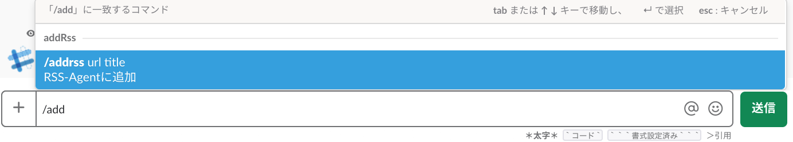

# RSS Agent

登録した RSS フィードからタイトルと URL を取り出して Twitter に投稿します．

# Description

 スプレッドシートをデータベースとして RSS フィードの情報を保持します．

# Demo

twitter へ RSS の記事を投稿


slack からスラッシュコマンドで購読する RSS を追加


# VS.

Feedly とか，inoreader とか

# Requirement

Google アカウント
Twitter
(Slack)

# Usage

設定が済めば，登録した RSS の記事が自動的にツイートされるはずです．

RSS を登録するには

```.json
{
    "text":"https://sample.com/feed  サンプルのサイト"
}
```

を post するか，スプレッドシートの新しいシートを作成して

- A1 に feed の url
- B1 に '=A1&"?d="&C1'
- A2 に '=importfeed(B1, "items", false, 20)

を記入します．

# Install

## 1. Twitter

1. 投稿するツイッターアカウントを用意します．
1. そのアカウントで api key と secret を取得します．(※詳しい方法は  他の記事参照)

## 2. Google

1. スプレッドシート
   1. 空のスプレッドシートを作成します．(RSS の情報を保持する DB になります．)
   1. スプレッドシートのキーをコピーしておきます．('https://docs.google.com/spreadsheets/d/******/edit〜' の**\*\***の部分)
1. GAS
   1. GAS プロジェクトを作成します．
   1. 作成したプロジェクトに`./dist/main.gs`を GAS にアップロードします．
        - claspを用いる場合には，.clasp.jsonを作成してください．
   1. リソースのライブラリに`1CXDCY5sqT9ph64fFwSzVtXnbjpSfWdRymafDrtIZ7Z_hwysTY7IIhi7s`を追加すると OAuth1 が表示されるので，最新バージョンを選びます．
   1. プロジェクトのスクリプトプロパティに追加します． - TWITTER_KEY: Twitter API の key - TWITTER_SECRET: Twitter API の secret - SHEET_KEY: スプレッドシートのキー
      1.auth メソッドを起動するとログに認証用リンクが表示されるので，開いて認証します．
   1. 定期的に記事を取り込むためにトリガーを設定します．
   1. web アプリケーションとして公開します．(この  アプリの URL をとっておきます)

## Slack

1. Slack に管理者としてログインします．
1. スラッシュコマンドを作成します．
   1.  あて先を先程の URL に設定．

# Contribution

RSS の取得は
[【Google Apps Script】その 16 　 GAS とスプレッドシートだけで簡易 RSS リーダーを作り、Chatwork に新着通知する](https://qiita.com/rf_p/items/3e20e4114a1182deb7bc#%E3%82%B9%E3%83%97%E3%83%AC%E3%83%83%E3%83%89%E3%82%B7%E3%83%BC%E3%83%88%E3%81%AE%E6%BA%96%E5%82%99) を参考にしました．
ただ，Twitter への投稿が認証部分でうまくイカなかったです．

そのため，GAS から Twitter への投稿は次を参考にさせていただきました．
[Google Apps Script (GAS) で Twitter へ投稿するだけの機能を実装してみる](https://qiita.com/akkey2475/items/ad190a507b4a7b7dc17c#%E3%83%97%E3%83%AD%E3%82%B0%E3%83%A9%E3%83%A0%E4%BD%9C%E6%88%90)

# Licence

[MIT](https://github.com/tcnksm/tool/blob/master/LICENCE)

# Author

[ryoto7ishikawa](https://github.com/ryoto7ishikawa)
